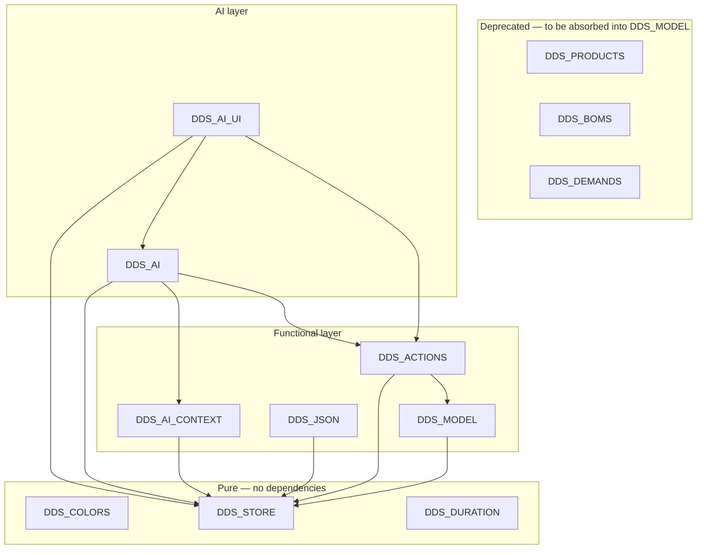

# DDScope — Module Registry
*v0.5 — Draft — May 2026*

---

## Version History

| Version | Date | Summary |
|---|---|---|
| 0.1 | May 2026 | Initial registry |
| 0.2 | May 2026 | Reframed as machine-readable database; format densified; prose sections removed |
| 0.3 | May 2026 | DDS_ACTIONS added (SCRIPT 1850); DDS_AI_EXECUTOR removed; DDS_AI and DDS_AI_UI dependencies updated |
| 0.4 | May 2026 | Dependency graph added; DDS_MODEL introduced as functional integrity layer; DDS_PRODUCTS, DDS_BOMS, DDS_DEMANDS, DDS_NODES marked deprecated; DDS_ACTIONS and DDS_REMOVE dependencies updated |
| 0.5 | May 2026 | Layered write architecture documented: UI/AI write only via DDS_ACTIONS; DDS_ACTIONS uses DDS_STORE for simple ops and DDS_MODEL for cascades; reads unrestricted. Dependency graph updated. |

---

## Purpose and Usage

**This file is a machine-readable database.** Authoritative source of truth for DDScope JavaScript module definitions. Consumed by AI assistants (Claude in DEV and TEST contexts).

**What is recorded here:** module identity, CommWise block address, public API, runtime dependencies, testability classification, extraction readiness.

**What is not recorded here:** implementation details, UI behaviour (see `DDScope_UI.md`), data model rules (see `DDScope_DataModel.md`).

Both DEV and TEST contexts must keep their copy in sync (manual transfer — see `README.md`).

---

## Layered Write Architecture

```
UI modules / AI modules
        ↓  (all writes)
   DDS_ACTIONS
        ↓ simple ops          ↓ cascade ops
   DDS_STORE              DDS_MODEL
        ↓                      ↓
              DDS_STORE (raw CRUD)
```

**Rule 1 — UI and AI write only via `DDS_ACTIONS`.**
No UI module and no AI module may call `DDS_STORE.insert/update/remove` or `DDS_MODEL.*` directly on functional layer tables. All writes from these layers go through `DDS_ACTIONS.execute()`.

**Rule 2 — `DDS_ACTIONS` uses `DDS_STORE` for simple ops, `DDS_MODEL` for cascades.**
- Simple mutations (add, update): `DDS_ACTIONS` calls `DDS_STORE` directly.
- Cascade operations (delete_node, delete_flow, delete_product, delete_bom, remove_sku, delete_demand): `DDS_ACTIONS` delegates to `DDS_MODEL`.

**Rule 3 — reads are unrestricted.**
Any module may call `DDS_STORE.query` on any table at any time.

**Exception — presentation layer:**
`map_nodes`, `map_flows`, `map_swim_lanes`, `map_demands` are managed directly by presentation layer modules (`DDS_MAP`, `DDS_SWIMLANES`, `DDS_ELEMENTS`, etc.) and are outside `DDS_ACTIONS`' scope.

---

## Dependency Graph



**Notes:**
- `DDS_STORE` is the root dependency of all layers.
- `DDS_MODEL` handles all cascade operations. Currently delegates some operations to `DDS_PRODUCTS` and `DDS_NODES` (SCRIPT 1600) during the deprecation transition.
- `DDS_ACTIONS` is the single write entry point for UI and AI layers. Calls `DDS_STORE` for simple ops, `DDS_MODEL` for cascades.
- `DDS_REMOVE` (render-dependent, not in this registry) calls `DDS_ACTIONS` for full deletes and `DDS_ELEMENTS` for map-only removals.
- `DDS_PRODUCTS`, `DDS_BOMS`, `DDS_DEMANDS` are deprecated. Their logic migrates to `DDS_MODEL` and `DDS_ACTIONS`. UI modules must migrate to `DDS_ACTIONS.execute()` for all writes.
- Render-dependent modules (`DDS_MAP`, `DDS_SWIMLANES`, `DDS_LAYOUT`, `DDS_PANEL`, all `*_UI` modules) are not in this registry. Tested via Playwright only.

---

## Reference Tables

### Testability classes

| Class | Condition | Test layer |
|---|---|---|
| `pure` | No DOM, no Cytoscape, no globals beyond window shim | Vitest — no setup |
| `store-dependent` | Uses `DDS_STORE` / `DDS` state, no rendering | Vitest — store + DDS shim required |
| `render-dependent` | Requires Cytoscape canvas or DOM layout | Playwright |
| `out-of-scope` | File System Access API, IndexedDB, CommWise internals | Manual only |

### Extraction contract fields

| Field | Values | Meaning |
|---|---|---|
| `contract` | `met` / `partial` / `unverified` / `not-met` | Whether the block can be extracted without manual edits |
| `dom_mixed` | `yes` / `no` | DOM calls present inside core logic |
| `api_documented` | `yes` / `no` | Public API surface listed in block header comment |
| `deps_declared` | `yes` / `no` | Dependencies listed under `// Depends on:` in block header |

### Test scope fields

| Field | Owner | Values / Meaning |
|---|---|---|
| `test_scope` | DEV | Free-text per-method scenario list |
| `coverage` | TEST | `none` / `partial` / `full` |

### CommWise block title pattern

`JS: DDS_<MODULE> — <one-line description>`

### Extracted filename pattern

`src/<module_name>.js`

---

## Module Entries

---

### DDS_COLORS

```
global:         DDS_COLORS
block:          SCRIPT 105
file:           src/DDS_COLORS.js
testability:    pure
contract:       met
dom_mixed:      no
api_documented: yes
deps_declared:  yes
```

**Responsibility:** single source of truth for the 8-color hex palette.

**API:**
```
DDS_COLORS   // string[] — 8 hex color strings
```

**Dependencies:** none.

---

### DDS_STORE

```
global:         DDS_STORE
block:          SCRIPT 150
file:           src/DDS_STORE.js
testability:    pure
contract:       met
dom_mixed:      no
api_documented: no
deps_declared:  no
```

**Responsibility:** in-memory CRUD + serialization. No business rules — raw CRUD only.

**Write access:** `DDS_STORE.insert/update/remove` on functional tables is called by `DDS_ACTIONS` (simple ops) and `DDS_MODEL` (cascade ops) only. UI and AI modules use `DDS_STORE.query` for reads only.

**API:**
```
DDS_STORE.query(table, filters?, options?)   // record[]
DDS_STORE.insert(table, records)             // record[] — ids auto-assigned
DDS_STORE.update(table, filters, updates)    // record[]
DDS_STORE.remove(table, filters)             // record[]
DDS_STORE.markDirty()                        // void
DDS_STORE.resetDirty()                       // void
DDS_STORE.newProject(name, description, createdBy?)  // project
DDS_STORE.toJson()                           // string
DDS_STORE.loadFromText(text)                 // void
DDS_STORE.getProject()                       // project|null
DDS_STORE.setProject(json)                   // void
DDS_STORE.isDirty()                          // boolean
```

**Dependencies:** none.

**Pending refactor:** DOM isolation — `_markDirty()` calls `document.getElementById` directly. Target: `DDS_STORE.onDirtyChange` callback. Prerequisite for all store-dependent unit tests.

---

### DDS_DURATION

```
global:         DDS_DURATION
block:          SCRIPT 1650
file:           src/DDS_DURATION.js
testability:    pure
contract:       met
dom_mixed:      no
api_documented: yes
deps_declared:  yes
test_scope:
  toHours:   all 5 units; zero; NaN; unknown unit → 0
  compare:   h1 > h2; h1 < h2; h1 == h2 (tie → first wins)
  toDisplay: singular (v=1); plural (v>1); zero; unknown unit → ''
coverage:       full
```

**Responsibility:** duration arithmetic and formatting.

**API:**
```
DDS_DURATION.toHours(value, unit)        // number
DDS_DURATION.compare(v1, u1, v2, u2)    // { value, unit }
DDS_DURATION.toDisplay(value, unit)      // string
```

**Dependencies:** none.

---

### DDS_MODEL

```
global:         DDS_MODEL
block:          SCRIPT 1550
file:           src/DDS_MODEL.js
testability:    store-dependent
contract:       partial  (cascade ops implemented; add/update ops not needed — handled by DDS_ACTIONS+DDS_STORE)
dom_mixed:      no
api_documented: yes
deps_declared:  yes
```

**Responsibility:** authoritative runtime implementation of cascade delete rules (`DDScope_DataModel.md` §17.1). The only module that handles operations with cascade side-effects on the functional model. Called by `DDS_ACTIONS` for cascade operations only.

**API (cascade operations):**
```
DDS_MODEL.deleteNode(nodeId)
DDS_MODEL.deleteFlow(flowId)
DDS_MODEL.deleteProduct(productId)
DDS_MODEL.deleteSwimLane(swimLaneId)
DDS_MODEL.removeSku(nodeId, productId)
DDS_MODEL.deleteDemand(nodeId, productId)
DDS_MODEL.deleteBom(bomId)
DDS_MODEL.rerouteFlow(flowId, newSourceId?, newTargetId?)
DDS_MODEL.addProductToFlow(flowId, productId)
DDS_MODEL.removeProductFromFlow(flowId, productId)
```

**Dependencies:**
```
DDS_STORE    SCRIPT 150
DDS_NODES    SCRIPT 1600  (transitional — product-node cascade; will be absorbed)
DDS_PRODUCTS SCRIPT 1600  (transitional — product-node cascade; will be absorbed)
```

**test_scope:**
```
deleteNode:
  node with no flows, no SKUs, no BOMs, no demands → only nodes + map_nodes removed
  node with connected flows → flows + map_flows removed across all maps
  node with SKUs → skus removed
  node with BOMs → boms + bom_components removed
  node with demands → demands + map_demands removed
  node on multiple maps → map_nodes removed from all maps
deleteFlow:
  flow removed + map_flows across all maps
  no SKU modification
deleteProduct:
  product removed from flows[].product_ids on all flows
  skus for this product removed
  boms where output_product_id matches removed + bom_components
  bom_components where product_id matches removed; parent bom removed if no components remain
  demands for this product removed + map_demands
deleteSwimLane:
  each assigned node deleted with full deleteNode cascade
  map_swim_lanes removed across all maps
  default_swim_lane_id cleared on affected node_types
removeSku:
  demand for node x product removed if exists + map_demands
  CTT geometry reset on map_nodes if no demands remain for node
  sku record removed
deleteDemand:
  map_demands removed
  CTT geometry reset on map_nodes if no demands remain for node
  demand record removed
deleteBom:
  bom_components removed; bom record removed
rerouteFlow / addProductToFlow / removeProductFromFlow:
  flow record updated; no SKU modification
coverage: none
```

---

### DDS_ACTIONS

```
global:         DDS_ACTIONS
block:          SCRIPT 1850
file:           src/DDS_ACTIONS.js
testability:    store-dependent
contract:       unverified
dom_mixed:      no
api_documented: yes
deps_declared:  yes
```

**Responsibility:** single write entry point for UI and AI layers. Translates action lists into `DDS_STORE` calls (simple ops) or `DDS_MODEL` calls (cascade ops). Provides the action vocabulary and human-readable descriptions.

**Cascade actions** (routed to `DDS_MODEL`): `delete_node`, `delete_flow`, `delete_product`, `delete_bom`, `remove_sku`, `delete_demand`.

**Simple actions** (routed to `DDS_STORE` directly): `add_node`, `update_node`, `add_flow`, `update_flow`, `add_product`, `update_product`, `add_sku`, `update_sku`, `add_swim_lane`, `update_swim_lane`, `add_bom`, `update_bom`, `add_bom_component`, `update_bom_component`, `remove_bom_component`, `add_demand`, `update_demand`, `reroute_flow`, `add_product_to_flow`, `remove_product_from_flow`.

**Robustness:** normalises `action.action → action.type` at the start of `execute()` and `describe()`.

**API:**
```
DDS_ACTIONS.execute(actions)       // Promise<{ applied: action[], failed: action|null }>
DDS_ACTIONS.describe(actions)      // { index: number, label: string }[]
DDS_ACTIONS.getVocabularyText()    // string — injected into Claude system prompt
DDS_ACTIONS.ACTIONS                // object — structured vocabulary definitions
```

**Dependencies:**
```
DDS_STORE   SCRIPT 150
DDS_MODEL   SCRIPT 1550
```

---

### DDS_AI_CONTEXT

```
global:         DDS_AI_CONTEXT
block:          SCRIPT 2200
file:           src/DDS_AI_CONTEXT.js
testability:    store-dependent
contract:       unverified
dom_mixed:      no  (expected)
api_documented: no
deps_declared:  no
```

**Responsibility:** serialises the current project to Claude context JSON (`DDScope_AI_Assistant.md` §4). Read-only — uses `DDS_STORE.query` only.

**API:**
```
DDS_AI_CONTEXT.build()   // object — Claude context JSON
```

**Dependencies:**
```
DDS_STORE   SCRIPT 150
DDS         SCRIPT 400
```

---

### DDS_AI

```
global:         DDS_AI
block:          SCRIPT 2400
file:           src/DDS_AI.js
testability:    out-of-scope
contract:       unverified
dom_mixed:      no  (expected)
api_documented: no
deps_declared:  no
```

**Responsibility:** system prompt assembly, Claude API call via CommWise secure proxy, response validation. Writes via `DDS_ACTIONS.execute()` only.

**Dependencies:**
```
DDS_STORE        SCRIPT 150
DDS              SCRIPT 400
DDS_AI_CONTEXT   SCRIPT 2200
DDS_ACTIONS      SCRIPT 1850
```

---

### DDS_AI_UI

```
global:         DDS_AI_UI
block:          SCRIPT 2500
file:           src/DDS_AI_UI.js
testability:    render-dependent
contract:       unverified
dom_mixed:      yes  (expected)
api_documented: no
deps_declared:  no
```

**Responsibility:** AI panel rendering, plan display, confirm/cancel. Writes via `DDS_ACTIONS.execute()` only.

**Dependencies:**
```
DDS_STORE        SCRIPT 150
DDS              SCRIPT 400
DDS_AI           SCRIPT 2400
DDS_ACTIONS      SCRIPT 1850
```

---

### DDS_JSON

```
global:         DDS_JSON
block:          SCRIPT 600
file:           src/DDS_JSON.js
testability:    store-dependent
contract:       unverified
dom_mixed:      no  (expected)
api_documented: no
deps_declared:  no
```

**Responsibility:** project import with full ID remapping. Supports copy modes `full`, `lanes`, `types`. Uses `DDS_STORE` directly for batch inserts during import (exception to Rule 1 — import is a bulk initialisation operation, not a functional mutation).

**API:**
```
DDS_JSON.importProject(sourceJson, mode)   // void
```

**Dependencies:**
```
DDS_STORE   SCRIPT 150
DDS         SCRIPT 400
```

---

### DDS_PRODUCTS ⚠️ DEPRECATED

```
global:         DDS_PRODUCTS
block:          SCRIPT 1600
file:           src/DDS_PRODUCTS.js
testability:    store-dependent
contract:       unverified
dom_mixed:      unverified
api_documented: no
deps_declared:  no
status:         deprecated — cascade logic migrated to DDS_MODEL; CRUD callers must migrate to DDS_ACTIONS
```

**Note:** SCRIPT 1600 also contains `DDS_NODES` (non-exported `var`). Both will be superseded by `DDS_MODEL`.

**Current callers to migrate:**
- `DDS_NODES_UI` → `DDS_ACTIONS.execute([{ type: 'delete_node', ... }])`
- Any direct `DDS_PRODUCTS.create/update/delete` call → `DDS_ACTIONS.execute([{ type: 'add_product', ... }])`

**Dependencies:**
```
DDS_STORE   SCRIPT 150
DDS         SCRIPT 400
```

---

### DDS_BOMS ⚠️ DEPRECATED

```
global:         DDS_BOMS
block:          SCRIPT 1800
file:           src/DDS_BOMS.js
testability:    store-dependent
contract:       unverified
dom_mixed:      unverified
api_documented: no
deps_declared:  no
status:         deprecated — cascade logic migrated to DDS_MODEL; UI callers must migrate to DDS_ACTIONS
```

**Current callers to migrate:**
- `DDS_BOMS_UI.handleDelete` → `DDS_ACTIONS.execute([{ type: 'delete_bom', ... }])`
- `DDS_BOMS_UI` create/update → `DDS_ACTIONS.execute([{ type: 'add_bom', ... }])`

**Dependencies:**
```
DDS_STORE   SCRIPT 150
DDS         SCRIPT 400
```

---

### DDS_DEMANDS ⚠️ DEPRECATED

```
global:         DDS_DEMANDS
block:          SCRIPT 1660
file:           src/DDS_DEMANDS.js
testability:    store-dependent
contract:       unverified
dom_mixed:      unverified
api_documented: no
deps_declared:  no
status:         deprecated — cascade logic migrated to DDS_MODEL; UI callers must migrate to DDS_ACTIONS
```

**Note:** map demand visibility (`showOnMap`, `hideFromMap`) is a presentation concern and remains valid outside `DDS_ACTIONS` — these methods operate on `map_demands` (presentation layer), not the functional model.

**Current callers to migrate:**
- `DDS_PANEL` demand create/update/delete → `DDS_ACTIONS.execute([{ type: 'add_demand', ... }])`
- `DDS_DEMANDS_UI` update/delete → `DDS_ACTIONS.execute([{ type: 'update_demand', ... }])`
- `DDS_DEMANDS.showOnMap / hideFromMap` — **keep as-is** (presentation layer, not covered by Rule 1)

**Dependencies:**
```
DDS_STORE   SCRIPT 150
DDS         SCRIPT 400
```

---

## Backlog

- [ ] **Migrate `DDS_BOMS_UI`** — replace all `DDS_BOMS.*` write calls with `DDS_ACTIONS.execute()`
- [ ] **Migrate `DDS_PANEL` (demand section)** — replace `DDS_DEMANDS.ensureDemand/updateDemand/deleteForSku` with `DDS_ACTIONS.execute()`
- [ ] **Migrate `DDS_DEMANDS_UI`** — replace `DDS_DEMANDS.updateDemand/deleteForSku` with `DDS_ACTIONS.execute()`
- [ ] **Migrate `DDS_NODES_UI`** — verify and replace any direct delete calls with `DDS_ACTIONS.execute()`
- [ ] **Migrate `DDS_PRODUCTS_UI`** — verify and replace any direct write calls with `DDS_ACTIONS.execute()`
- [ ] **Migrate `DDS_FLOWS_UI`** — verify and replace any direct write calls with `DDS_ACTIONS.execute()`
- [ ] **Absorb `DDS_NODES` + `DDS_PRODUCTS` into `DDS_MODEL`** — eliminate the transitional dependency; `deleteNode` and `deleteProduct` cascade fully inlined in `DDS_MODEL`
- [ ] **Deprecate `DDS_BOMS`** — once `DDS_BOMS_UI` is migrated
- [ ] **Deprecate `DDS_DEMANDS`** — once panel and table UI are migrated (keep `showOnMap`/`hideFromMap` as standalone helpers or inline in UI)
- [ ] **`DDS_STORE` DOM isolation refactor** — prerequisite for all store-dependent unit tests
- [ ] **`DDS_MODEL.validateSkus()`** — non-destructive SKU coherence check (v2)

---

## Refactor Notes

### DDS_STORE — DOM isolation (prerequisite for store-dependent tests)

**Problem:** `_markDirty()` calls `document.getElementById` inside core CRUD logic.

**Target:** expose `DDS_STORE.onDirtyChange = null` callback:

```javascript
if (typeof DDS_STORE.onDirtyChange === 'function') {
  DDS_STORE.onDirtyChange(dirty, projectName);
}
```

DOM wiring moves to boot module. In tests: `onDirtyChange` left `null` — no DOM, no error.

**Unblocks:** `DDS_STORE`, `DDS_MODEL`, `DDS_ACTIONS`, `DDS_AI_CONTEXT`, `DDS_JSON`.

---

*b2wise — Confidential*
