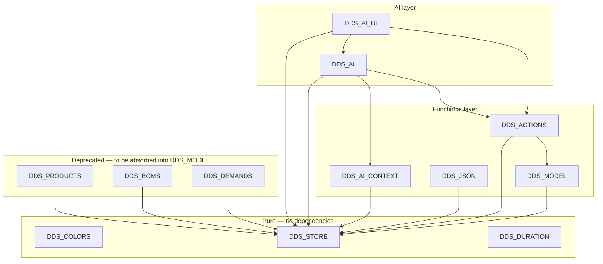

# DDScope — Module Registry
*v0.4 — Draft — May 2026*

---

## Version History

| Version | Date | Summary |
|---|---|---|
| 0.1 | May 2026 | Initial registry |
| 0.2 | May 2026 | Reframed as machine-readable database; format densified; prose sections removed |
| 0.3 | May 2026 | DDS_ACTIONS added (SCRIPT 1850); DDS_AI_EXECUTOR removed (absorbed into DDS_ACTIONS + DDS_AI_UI); DDS_AI and DDS_AI_UI dependencies updated |
| 0.4 | May 2026 | Dependency graph added; DDS_MODEL introduced as functional integrity layer; DDS_PRODUCTS, DDS_BOMS, DDS_DEMANDS, DDS_NODES marked deprecated; DDS_ACTIONS and DDS_REMOVE dependencies updated |

---

## Purpose and Usage

**This file is a machine-readable database.** It is the authoritative source of truth for DDScope JavaScript module definitions. It is consumed by AI assistants (Claude in DEV and TEST contexts) and is not intended to be read as documentation prose.

Human-readable summaries (for onboarding, PR descriptions, etc.) are generated on demand from this file — they are not stored here.

**What is recorded here:**
- The identity and CommWise address of every `DDS_*` module
- Its public API surface
- Its runtime dependencies
- Its testability classification and extraction readiness

**What is not recorded here:**
- Implementation details (those live in the CommWise blocks themselves)
- UI interaction behaviour (see `DDScope_UI.md`)
- Data model rules (see `DDScope_DataModel.md`)

**Who writes to this file:**
- **DEV** (Claude project) — adds and updates entries when modules are created, refactored, renamed, or their API changes; updates `contract`, `dom_mixed`, `api_documented`, `deps_declared` fields after inspection.
- **TEST** (this repository) — updates `testability` classification and contract fields discovered during extraction; updates `coverage` as tests are written; may also update `test_scope` when asked. The user is responsible for keeping both copies in sync.

Both contexts must keep their copy in sync (manual transfer — see `README.md`).

---

## Dependency Graph

The graph below shows inter-module dependencies for all `DDS_*` modules currently in this registry. Arrow direction: A → B means A depends on B.



**Notes:**
- `DDS_STORE` is the root dependency of all layers. It has no module-level dependency.
- `DDS_MODEL` is the single authoritative layer for functional integrity rules and cascade operations. It is the only module that may perform cascade deletions on the functional model. Its rules are specified in `DDScope_DataModel.md` §17.
- `DDS_ACTIONS` calls `DDS_MODEL` for all destructive operations (delete, remove). It calls `DDS_STORE` directly for simple operations without cascade (add, update).
- `DDS_REMOVE` (render-dependent, not in this registry) calls `DDS_MODEL` for full deletes and `DDS_ELEMENTS` for map-only removals.
- `DDS` (SCRIPT 400) is a CommWise runtime global referenced by several modules. It is not a `DDS_*` module and is not represented in this graph.
- `DDS_PRODUCTS`, `DDS_BOMS`, `DDS_DEMANDS` are deprecated. Their cascade logic migrates to `DDS_MODEL`; their CRUD logic will be absorbed or stubbed. Existing callers (UI modules) should migrate to `DDS_MODEL` progressively.
- Render-dependent modules (`DDS_MAP`, `DDS_SWIMLANES`, `DDS_LAYOUT`, `DDS_PANEL`, `DDS_NODE_UI`, `DDS_FLOW_UI`, etc.) are not in this registry. They are tested via Playwright only.

---

## Reference Tables

### Testability classes

| Class | Condition | Test layer |
|---|---|---|
| `pure` | No DOM, no Cytoscape, no globals beyond window shim | Vitest — no setup |
| `store-dependent` | Uses `DDS_STORE` / `DDS` state, no rendering | Vitest — store + DDS shim required |
| `render-dependent` | Requires Cytoscape canvas or DOM layout | Playwright |
| `out-of-scope` | File System Access API, IndexedDB, CommWise internals | Manual only |

### Extraction contract fields

| Field | Values | Meaning |
|---|---|---|
| `contract` | `met` / `partial` / `unverified` / `not-met` | Whether the block can be extracted without manual edits |
| `dom_mixed` | `yes` / `no` | DOM calls present inside core logic (not isolated in a UI bindings section) |
| `api_documented` | `yes` / `no` | Public API surface listed in the block header comment |
| `deps_declared` | `yes` / `no` | Dependencies listed in the block header comment under `// Depends on:` |

### Test scope fields

| Field | Owner | Values / Meaning |
|---|---|---|
| `test_scope` | DEV | Free-text per-method scenario list. Written by DEV based on API knowledge. |
| `coverage` | TEST | `none` / `partial` / `full` — updated by TEST as tests are written. |

### CommWise block title pattern

All DDScope module blocks must follow: `JS: DDS_<MODULE> — <one-line description>`

The `JS:` prefix is the selector used by `scripts/extract.js` to scope extraction to DDScope modules only.

### Extracted filename pattern

`src/<module_name>.js` — mirrors the JS global name exactly (e.g. `src/DDS_STORE.js`).

---

## Module Entries

---

### DDS_COLORS

```
global:       DDS_COLORS
block:        SCRIPT 105
file:         src/DDS_COLORS.js
testability:  pure
contract:     met
dom_mixed:    no
api_documented: yes
deps_declared:  yes
```

**Responsibility:** single source of truth for the 8-color hex palette used across swim-lanes, node types, product types, and tag colors.

**API:**
```
DDS_COLORS                          // string[] — 8 hex color strings (index = slot)
```

**Dependencies:** none.

---

### DDS_STORE

```
global:       DDS_STORE
block:        SCRIPT 150
file:         src/DDS_STORE.js
testability:  pure
contract:     met
dom_mixed:    no
api_documented: no
deps_declared:  no
```

**Responsibility:** in-memory CRUD on private in-module state (`_state.project`, `_state.dirty`) + serialization helpers (`toJson` / `loadFromText`). Single data access layer for all DDScope modules. No business rules — raw CRUD only.

**API:**
```
DDS_STORE.query(table, filters?, options?)   // record[]
DDS_STORE.insert(table, records)             // record[]  — ids auto-assigned
DDS_STORE.update(table, filters, updates)    // record[]
DDS_STORE.remove(table, filters)             // record[]
DDS_STORE.markDirty()                        // void
DDS_STORE.resetDirty()                       // void
DDS_STORE.newProject(name, description, createdBy?)  // project
DDS_STORE.toJson()                           // string
DDS_STORE.loadFromText(text)                 // void (throws on invalid DDScope JSON)
DDS_STORE.getProject()                       // project|null
DDS_STORE.setProject(json)                   // void
DDS_STORE.isDirty()                          // boolean
```

**Dependencies:** none.

**High-level test strategy (DDS_STORE):**
- **Test ownership matrix:**

| Area | Owner | Automation | Notes |
|---|---|---|---|
| Memory CRUD (`query/insert/update/remove`) | TEST | Unit (Vitest/Node) | No DDS shim required |
| Counters and seed (`_nextId`, `_seedCounters`) | TEST | Unit (Vitest/Node) | Per-table counters, seeded from existing max IDs |
| Dirty state and callback (`markDirty`, `resetDirty`, implicit dirty on writes) | TEST | Unit (Vitest/Node) | Validate callback contract and name resolution |
| Project structure bootstrap (`_blankProject`, `newProject`, `loadFromText`) | TEST | Unit (Vitest/Node) | Validate required arrays and invalid JSON rejection |
| Serialization and state access (`toJson`, `loadFromText`, `getProject`, `setProject`, `isDirty`) | TEST | Unit (Vitest/Node) | JSON round-trip, state replacement, and dirty-state reads |

---

### DDS_DURATION

```
global:       DDS_DURATION
block:        SCRIPT 1650
file:         src/DDS_DURATION.js
testability:  pure
contract:     met
dom_mixed:    no
api_documented: yes
deps_declared:  yes
test_scope:
  toHours:    all 5 units (hours/days/weeks/months/years); zero value; NaN value; unknown unit → 0
  compare:    h1 > h2; h1 < h2; h1 == h2 (tie → first argument wins)
  toDisplay:  singular (v=1, e.g. '1 day'); plural (v>1); zero; unknown unit → ''
coverage:     full
```

**Responsibility:** duration arithmetic and human-readable formatting. Used by CTT line rendering and future cumulative lead time display.

**API:**
```
DDS_DURATION.toHours(value, unit)        // number — converts to hours (internal base)
DDS_DURATION.compare(v1, u1, v2, u2)    // { value, unit } — returns the longer duration
DDS_DURATION.toDisplay(value, unit)      // string — e.g. "5 days", "1 week"
// DDS_DURATION.add(v1, u1, v2, u2)     // reserved — v2, not implemented
```

**Dependencies:** none.

---

### DDS_MODEL

```
global:       DDS_MODEL
block:        SCRIPT 1550   (to be created)
file:         src/DDS_MODEL.js
testability:  store-dependent
contract:     not-met       (not yet implemented)
dom_mixed:    no
api_documented: yes
deps_declared:  yes
```

**Responsibility:** authoritative runtime implementation of the DDScope functional integrity rules defined in `DDScope_DataModel.md` §17. The single module allowed to perform cascade deletions on the functional model. `DDS_STORE` is the data layer; `DDS_MODEL` is the business rules layer above it.

`DDS_MODEL` operates exclusively on the functional layer. It also cleans up presentation-layer records (`map_nodes`, `map_flows`, `map_swim_lanes`, `map_demands`) as part of referential integrity during cascade deletes — but it does not manage canvas positions, visibility toggles, or any other presentation concern.

**API:**
```
DDS_MODEL.deleteNode(nodeId)
  // Deletes the node and cascades:
  // flows (source or target) + their map_flows across all maps
  // skus for this node
  // boms for this node + their bom_components
  // demands for this node + their map_demands
  // map_nodes across all maps
  // The nodes record.

DDS_MODEL.deleteFlow(flowId)
  // Deletes the flow and its map_flows across all maps.
  // No SKU modification.

DDS_MODEL.deleteProduct(productId)
  // Removes productId from all flows[].product_ids.
  // Deletes all skus for this product.
  // Deletes all boms where output_product_id matches + their bom_components.
  // Deletes all bom_components where product_id matches
  //   (+ parent bom if left with no components).
  // Deletes all demands for this product + their map_demands.
  // Deletes the products record.

DDS_MODEL.deleteSwimLane(swimLaneId)
  // Calls deleteNode for each node assigned to this swim-lane.
  // Deletes map_swim_lanes across all maps.
  // Clears default_swim_lane_id on any node_types record that referenced this lane.
  // Deletes the swim_lanes record.

DDS_MODEL.removeSku(nodeId, productId)
  // Deletes the demand for this node x product pair if it exists + its map_demands.
  // Deletes the skus record.

DDS_MODEL.deleteDemand(nodeId, productId)
  // Deletes all map_demands for this demand.
  // Deletes the demands record.

DDS_MODEL.deleteBom(bomId)
  // Deletes all bom_components for this BOM.
  // Deletes the boms record.

DDS_MODEL.rerouteFlow(flowId, newSourceId?, newTargetId?)
  // Updates source_node_id and/or target_node_id on the flows record.
  // No SKU modification.

DDS_MODEL.addProductToFlow(flowId, productId)
  // Appends productId to flows[flowId].product_ids.
  // No SKU creation.

DDS_MODEL.removeProductFromFlow(flowId, productId)
  // Removes productId from flows[flowId].product_ids.
  // No SKU deletion.

// Future — v2:
// DDS_MODEL.validateSkus()
//   Non-destructive. Detects missing SKUs (product on flow, no SKU on endpoint)
//   and orphan SKUs (no connected flow, not a product-node). Returns a report
//   with proposed add/remove actions for consultant confirmation.
```

**Dependencies:**
```
DDS_STORE   SCRIPT 150
```

**test_scope:**
```
deleteNode:
  node with no flows, no SKUs, no BOMs, no demands → only nodes + map_nodes removed
  node with connected flows → flows + map_flows removed across all maps
  node with SKUs → skus removed
  node with BOMs → boms + bom_components removed
  node with demands → demands + map_demands removed
  node on multiple maps → map_nodes removed from all maps
deleteFlow:
  flow removed + map_flows across all maps
  no SKU modification (SKUs on endpoints unchanged)
deleteProduct:
  product removed from flows[].product_ids on all flows
  skus for this product removed
  boms where output_product_id matches removed + their bom_components
  bom_components where product_id matches removed; parent bom removed if no components remain
  demands for this product removed + map_demands
deleteSwimLane:
  each assigned node deleted with full deleteNode cascade
  map_swim_lanes removed across all maps
  default_swim_lane_id cleared on node_types that referenced this lane
removeSku:
  demand for node x product removed if exists + map_demands
  sku record removed
deleteDemand:
  map_demands removed
  demand record removed
deleteBom:
  bom_components removed
  bom record removed
rerouteFlow:
  source_node_id and/or target_node_id updated
  no SKU modification
addProductToFlow / removeProductFromFlow:
  product_ids updated on flow record
  no SKU modification
coverage: none
```

---

### DDS_ACTIONS

```
global:       DDS_ACTIONS
block:        SCRIPT 1850
file:         src/DDS_ACTIONS.js
testability:  store-dependent
contract:     unverified
dom_mixed:    no
api_documented: yes
deps_declared:  yes
```

**Responsibility:** action execution engine for the DDScope functional model. Translates an ordered action list (from the AI assistant, the UI, or future automation) into `DDS_MODEL` and `DDS_STORE` calls. Provides the action vocabulary definition and human-readable action descriptions for the confirmation UI.

`DDS_ACTIONS` is an orchestrator — it does not contain integrity rules. For destructive operations it delegates to `DDS_MODEL`; for simple add/update operations without cascade it calls `DDS_STORE` directly.

The action vocabulary is specified in `DDScope_Actions.md`. `DDS_ACTIONS` is its authoritative runtime implementation.

**API:**
```
DDS_ACTIONS.execute(actions)       // Promise<{ applied: action[], failed: action|null }>
DDS_ACTIONS.describe(actions)      // { index: number, label: string }[]
DDS_ACTIONS.getVocabularyText()    // string — injected into Claude system prompt
DDS_ACTIONS.ACTIONS                // object — structured action definitions
```

**Dependencies:**
```
DDS_STORE   SCRIPT 150
DDS_MODEL   SCRIPT 1550
```

**Note:** current implementation calls `DDS_STORE` directly for all operations including destructive ones — `DDS_MODEL` is not yet implemented. Migration to `DDS_MODEL` calls is part of the `DDS_MODEL` implementation chantier.

---

### DDS_AI_CONTEXT

```
global:       DDS_AI_CONTEXT
block:        SCRIPT 2200
file:         src/DDS_AI_CONTEXT.js
testability:  store-dependent
contract:     unverified
dom_mixed:    no  (expected)
api_documented: no
deps_declared:  no
```

**Responsibility:** serialises the current in-memory project into the Claude context JSON format defined in `DDScope_AI_Assistant.md` §4. Called before every AI request.

**API:**
```
DDS_AI_CONTEXT.build()   // object — Claude context JSON
```

**Dependencies:**
```
DDS_STORE   SCRIPT 150
DDS         SCRIPT 400
```

---

### DDS_AI

```
global:       DDS_AI
block:        SCRIPT 2400
file:         src/DDS_AI.js
testability:  out-of-scope
contract:     unverified
dom_mixed:    no  (expected)
api_documented: no
deps_declared:  no
```

**Responsibility:** system prompt assembly via `DDS_ACTIONS.getVocabularyText()`, Claude API call via CommWise secure proxy, response validation.

**Dependencies:**
```
DDS_STORE        SCRIPT 150
DDS              SCRIPT 400
DDS_AI_CONTEXT   SCRIPT 2200
DDS_ACTIONS      SCRIPT 1850
```

---

### DDS_AI_UI

```
global:       DDS_AI_UI
block:        SCRIPT 2500
file:         src/DDS_AI_UI.js
testability:  render-dependent
contract:     unverified
dom_mixed:    yes  (expected)
api_documented: no
deps_declared:  no
```

**Responsibility:** AI panel rendering, message bubbles, plan display via `DDS_ACTIONS.describe()`, confirm/cancel interactions, error reporting.

**Dependencies:**
```
DDS_STORE        SCRIPT 150
DDS              SCRIPT 400
DDS_AI           SCRIPT 2400
DDS_ACTIONS      SCRIPT 1850
```

---

### DDS_JSON

```
global:       DDS_JSON
block:        SCRIPT 600
file:         src/DDS_JSON.js
testability:  store-dependent
contract:     unverified
dom_mixed:    no  (expected)
api_documented: no
deps_declared:  no
```

**Responsibility:** imports a source project JSON into the current in-memory project with full ID remapping. Supports copy modes `full`, `lanes`, `types`.

**API:**
```
DDS_JSON.importProject(sourceJson, mode)   // void
```

**Dependencies:**
```
DDS_STORE   SCRIPT 150
DDS         SCRIPT 400
```

---

### DDS_PRODUCTS ⚠️ DEPRECATED

```
global:       DDS_PRODUCTS
block:        SCRIPT 1600
file:         src/DDS_PRODUCTS.js
testability:  store-dependent
contract:     unverified
dom_mixed:    unverified
api_documented: no
deps_declared:  no
status:       deprecated — cascade logic migrates to DDS_MODEL; CRUD to be absorbed or stubbed
```

**Note:** SCRIPT 1600 also contains `DDS_NODES` (a non-exported `var`) whose `deleteNode` logic is the reference implementation currently used by `DDS_REMOVE`. Both will be superseded by `DDS_MODEL`.

**Responsibility (current):** product CRUD + SKU sync + node-product cascade. To be replaced by `DDS_MODEL` for cascade operations. Simple CRUD (`getAll`, `create`, `update`) will either migrate to `DDS_MODEL` or be called directly via `DDS_STORE` by UI modules.

**Dependencies:**
```
DDS_STORE   SCRIPT 150
DDS         SCRIPT 400
```

---

### DDS_BOMS ⚠️ DEPRECATED

```
global:       DDS_BOMS
block:        SCRIPT 1800
file:         src/DDS_BOMS.js
testability:  store-dependent
contract:     unverified
dom_mixed:    unverified
api_documented: no
deps_declared:  no
status:       deprecated — cascade logic migrates to DDS_MODEL
```

**Responsibility (current):** BOM and BOM component CRUD with cascade. To be replaced by `DDS_MODEL.deleteBom()` for cascade; simple CRUD via `DDS_STORE` directly.

**Dependencies:**
```
DDS_STORE   SCRIPT 150
DDS         SCRIPT 400
```

---

### DDS_DEMANDS ⚠️ DEPRECATED

```
global:       DDS_DEMANDS
block:        SCRIPT 1660
file:         src/DDS_DEMANDS.js
testability:  store-dependent
contract:     unverified
dom_mixed:    unverified
api_documented: no
deps_declared:  no
status:       deprecated — cascade logic migrates to DDS_MODEL
```

**Responsibility (current):** demand record CRUD and `map_demands` visibility toggling. Cascade from `delete_node`, `delete_product`, `remove_sku` will be absorbed into `DDS_MODEL`. Map demand visibility toggling (opt-in CTT line display) remains a UI concern and is not part of `DDS_MODEL`.

**Dependencies:**
```
DDS_STORE   SCRIPT 150
DDS         SCRIPT 400
```

---

## Backlog

- [ ] **Implement `DDS_MODEL`** (SCRIPT 1550) — functional integrity layer as specified above. Migrate cascade logic from `DDS_PRODUCTS` / `DDS_NODES` / `DDS_REMOVE._execDeleteFlow` / `DDS_BOMS` / `DDS_DEMANDS`. Update `DDS_ACTIONS.execute()` to call `DDS_MODEL` for destructive operations. Update `DDS_REMOVE` to call `DDS_MODEL` instead of inline logic.
- [ ] **Deprecate `DDS_PRODUCTS`** — once all callers (UI modules) have migrated to `DDS_MODEL` / `DDS_STORE` direct calls.
- [ ] **Deprecate `DDS_BOMS`** — same condition.
- [ ] **Deprecate `DDS_DEMANDS`** — same condition.
- [ ] **`DDS_MODEL.validateSkus()`** — non-destructive SKU coherence check. Detects missing and orphan SKUs; returns proposed corrections for consultant confirmation. See `DDScope_DataModel.md` §17.4.

---

## Refactor Notes

### DDS_AI_EXECUTOR — supprimé

Logique absorbée dans `DDS_ACTIONS` et `DDS_AI_UI`. Le bloc CommWise correspondant peut être archivé ou supprimé lors du prochain chantier AI.

---

*b2wise — Confidential*
