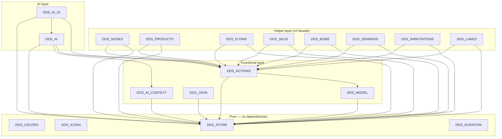

# DDScope — Module Registry
*v0.9 — Draft — May 2026*

---

## Version History

| Version | Date | Summary |
|---|---|---|
| 0.1 | May 2026 | Initial registry |
| 0.2 | May 2026 | Reframed as machine-readable database; format densified; prose sections removed |
| 0.3 | May 2026 | DDS_ACTIONS added (SCRIPT 1850); DDS_AI_EXECUTOR removed; DDS_AI and DDS_AI_UI dependencies updated |
| 0.4 | May 2026 | Dependency graph added; DDS_MODEL introduced as functional integrity layer; DDS_PRODUCTS, DDS_BOMS, DDS_DEMANDS, DDS_NODES marked deprecated; DDS_ACTIONS and DDS_REMOVE dependencies updated |
| 0.5 | May 2026 | Layered write architecture documented: UI/AI write only via DDS_ACTIONS; DDS_ACTIONS uses DDS_STORE for simple ops and DDS_MODEL for cascades; reads unrestricted. Dependency graph updated. |
| 0.6 | May 2026 | Helper layer introduced: DDS_NODES, DDS_PRODUCTS, DDS_FLOWS, DDS_SKUS created; DDS_BOMS and DDS_DEMANDS refactored as helpers (no longer deprecated). UI modules call helpers only — no direct DDS_STORE or DDS_ACTIONS calls. DDS_ACTIONS.execute() made synchronous. |
| 0.7 | May 2026 | DDS_LANES added as helper facade for swim lane CRUD. delete() is a cascade routed via DDS_MODEL.deleteSwimLane. |
| 0.8 | May 2026 | DDS_ICONS added (SCRIPT 110) — SVG icon library for node types; icon_key, label_position, transparent_bg documented. |
| 0.9 | May 2026 | DDS_ANNOTATIONS (SCRIPT 1670) and DDS_ANNOTATIONS_UI (SCRIPT 1780) added. DDS_MODEL.deleteAnnotation added. |
| 1.0 | May 2026 | DDS_TRANSACTION (SCRIPT 1860) added - stub undo/redo transaction manager |

---

## Purpose and Usage

**This file is a machine-readable database.** Authoritative source of truth for DDScope JavaScript module definitions. Consumed by AI assistants (Claude in DEV and TEST contexts).

**What is recorded here:** module identity, CommWise block address, public API, runtime dependencies, testability classification, extraction readiness.

**What is not recorded here:** implementation details, UI behaviour (see `DDScope_UI.md`), data model rules (see `DDScope_DataModel.md`).

Both DEV and TEST contexts must keep their copy in sync (manual transfer — see `README.md`).

---

## Layered Write Architecture

```
UI modules / AI modules
        ↓  (all writes)
   Helper layer                    ← DDS_NODES, DDS_PRODUCTS, DDS_FLOWS,
   (DDS_NODES, DDS_PRODUCTS,         DDS_SKUS, DDS_BOMS, DDS_DEMANDS,
    DDS_FLOWS, DDS_SKUS,             DDS_ANNOTATIONS
    DDS_BOMS, DDS_DEMANDS,
    DDS_ANNOTATIONS)
        ↓  translates to actions
   DDS_ACTIONS  (synchronous)
        ↓ simple ops          ↓ cascade ops
   DDS_STORE              DDS_MODEL
        ↓                      ↓
              DDS_STORE (raw CRUD)
```

**Rule 1 — UI writes only via helpers.**
No UI module may call `DDS_ACTIONS.execute()`, `DDS_STORE.insert/update/remove`, or `DDS_MODEL.*` directly on functional layer tables. All writes from UI go through a domain helper (e.g. `DDS_NODES.create(...)`, `DDS_BOMS.delete(...)`, `DDS_ANNOTATIONS.delete(...)`).

**Rule 2 — AI writes via `DDS_ACTIONS` directly.**
AI modules (`DDS_AI`, `DDS_AI_UI`) call `DDS_ACTIONS.execute()` directly — they do not go through helpers.

**Rule 3 — Helpers translate to actions.**
Each helper method builds an action list and calls `DDS_ACTIONS.execute()` synchronously. Helpers also expose read methods (`getAll`, `getById`, etc.) as wrappers over `DDS_STORE.query`.

**Rule 4 — `DDS_ACTIONS.execute()` is synchronous.**
Returns `{ applied: action[], failed: action|null }` directly. No Promise, no async/await in the call chain from UI to store.

**Rule 5 — `DDS_ACTIONS` uses `DDS_STORE` for simple ops, `DDS_MODEL` for cascades.**
- Simple mutations (add, update): `DDS_ACTIONS` calls `DDS_STORE` directly.
- Cascade operations (delete_node, delete_flow, delete_product, delete_bom, remove_sku, delete_demand, delete_annotation): `DDS_ACTIONS` delegates to `DDS_MODEL`.

**Rule 6 — reads are unrestricted.**
Any module may call `DDS_STORE.query` on any table at any time. Helpers expose named read methods for UI convenience — UI modules should prefer helper reads over direct `DDS_STORE.query` calls.

**Exception — presentation layer:**
`map_nodes`, `map_flows`, `map_swim_lanes`, `map_demands`, `map_annotations` are managed directly by presentation layer modules (`DDS_MAP`, `DDS_SWIMLANES`, `DDS_ELEMENTS`, etc.) and are outside `DDS_ACTIONS`' scope.

### Transaction ownership

`DDS_TRANSACTION` is called by UI layer modules only. `DDS_ACTIONS` is not transaction-aware.

A single user interaction may chain multiple `DDS_ACTIONS.execute()` calls. The UI module is
responsible for:
- calling `DDS_TRANSACTION.begin(label)` before the first `execute()` call,
- calling `DDS_TRANSACTION.commit(transactionId)` after the last successful `execute()` call,
- calling `DDS_TRANSACTION.rollback(transactionId)` if any `execute()` call fails or the
  interaction is cancelled.

---

## Dependency Graph



**Notes:**
- `DDS_STORE` is the root dependency of all layers.
- `DDS_ICONS` is pure — no dependencies. Used by presentation layer (`DDS_MAP`) at render time.
- `DDS_MODEL` handles all cascade operations.
- `DDS_ACTIONS` is the single write entry point — synchronous. Calls `DDS_STORE` for simple ops, `DDS_MODEL` for cascades.
- Helper layer modules translate semantic UI calls into action lists and delegate to `DDS_ACTIONS.execute()`.
- `DDS_REMOVE` (render-dependent, not in this registry) calls `DDS_ACTIONS` for full deletes and `DDS_ELEMENTS` for map-only removals.
- Render-dependent modules (`DDS_MAP`, `DDS_SWIMLANES`, `DDS_LAYOUT`, `DDS_PANEL`, all `*_UI` modules) are not in this registry. Tested via Playwright only.

---

## Reference Tables

### Testability classes

| Class | Condition | Test layer |
|---|---|---|
| `pure` | No DOM, no Cytoscape, no globals beyond window shim | Vitest — no setup |
| `store-dependent` | Uses `DDS_STORE` / `DDS` state, no rendering | Vitest — store + DDS shim required |
| `render-dependent` | Requires Cytoscape canvas or DOM layout | Playwright |
| `out-of-scope` | File System Access API, IndexedDB, CommWise internals | Manual only |

### Extraction contract fields

| Field | Values | Meaning |
|---|---|---|
| `contract` | `met` / `partial` / `unverified` / `not-met` | Whether the block can be extracted without manual edits |
| `dom_mixed` | `yes` / `no` | DOM calls present inside core logic |
| `api_documented` | `yes` / `no` | Public API surface listed in block header comment |
| `deps_declared` | `yes` / `no` | Dependencies listed under `// Depends on:` in block header |

### Test scope fields

| Field | Owner | Values / Meaning |
|---|---|---|
| `test_scope` | DEV | Free-text per-method scenario list |
| `coverage` | TEST | `none` / `partial` / `full` |

### CommWise block title pattern

`JS: DDS_<MODULE> — <one-line description>`

### Extracted filename pattern

`src/<module_name>.js`

---

## Module Entries

---

### DDS_COLORS

```
global:         DDS_COLORS
block:          SCRIPT 105
file:           src/DDS_COLORS.js
testability:    pure
contract:       met
dom_mixed:      no
api_documented: yes
deps_declared:  yes
```

**Responsibility:** single source of truth for the 8-color hex palette.

**API:**
```
DDS_COLORS   // string[] — 8 hex color strings
```

**Dependencies:** none.

---

### DDS_ICONS

```
global:         DDS_ICONS
block:          SCRIPT 110
file:           src/DDS_ICONS.js
testability:    pure
contract:       not-met
dom_mixed:      no
api_documented: yes
deps_declared:  yes
```

**Responsibility:** centralised SVG icon library for node types. Exposes a keyed dictionary of SVG strings and utility methods for rendering. All SVGs in the library carry explicit `width="32" height="32"` attributes — required for correct Cytoscape `background-image` sizing.

**Two icon modes** (driven by `node_types[].transparent_bg`):

| Mode | `transparent_bg` | SVG fill | Cytoscape background |
|---|---|---|---|
| White icon | `false` (default) | `fill="white"` fixed | `background-color` = tag color, `background-opacity: 1` |
| Colored icon | `true` | `fill="{{color}}"` replaced at render time | `background-opacity: 0` (transparent) |

**API:**
```
DDS_ICONS.LIBRARY                    // { [key: string]: string } — raw SVG strings with {{color}} placeholder where applicable
DDS_ICONS.list()                     // { key: string, label: string }[] — for Settings UI icon selector
DDS_ICONS.get(key)                   // string | null — raw SVG or null if key unknown
DDS_ICONS.toDataUrl(key, color?)     // string | null — encoded data URL; replaces {{color}} when provided
```

**SVG authoring conventions:**
- `viewBox="0 0 100 100"` — normalised coordinate space.
- `width="32" height="32"` — explicit intrinsic size, mandatory for Cytoscape `background-image` sizing.
- White-icon mode: all shapes use `fill="white"`.
- Colored-icon mode: all shapes use `fill="{{color}}"` — replaced by `toDataUrl(key, color)` at render time.
- All shapes must stay within `x=5..95`, `y=5..95` to avoid clipping.
- No `<style>` blocks, no external references, no scripts.

**Initial library (v1):**

| Key | Label | Mode |
|---|---|---|
| `factory` | Usine / Site de production | white |
| `warehouse` | Entrepôt | white |
| `supplier` | Fournisseur externe | white |
| `customer` | Client | white |
| `dc` | Centre de distribution | white |
| `cylinder` | Système informatique | colored |

**Fallback:** if `icon_key` is absent, null, or not found in `DDS_ICONS.LIBRARY`, the node renders using `shape` and `background-color` only — no `background-image` applied. Fully backwards-compatible with existing projects.

**Dependencies:** none.

---

### DDS_STORE

```
global:         DDS_STORE
block:          SCRIPT 150
file:           src/DDS_STORE.js
testability:    pure
contract:       met
dom_mixed:      no
api_documented: no
deps_declared:  no
```

**Responsibility:** in-memory CRUD + serialization. No business rules — raw CRUD only.

**Write access:** `DDS_STORE.insert/update/remove` on functional tables is called by `DDS_ACTIONS` (simple ops) and `DDS_MODEL` (cascade ops) only. UI modules use helpers for writes and `DDS_STORE.query` for reads when no helper read method is available.

**API:**
```
DDS_STORE.query(table, filters?, options?)   // record[]
DDS_STORE.insert(table, records)             // record[] — ids auto-assigned
DDS_STORE.update(table, filters, updates)    // record[]
DDS_STORE.remove(table, filters)             // record[]
DDS_STORE.markDirty()                        // void
DDS_STORE.resetDirty()                       // void
DDS_STORE.newProject(name, description, createdBy?)  // project
DDS_STORE.toJson()                           // string
DDS_STORE.loadFromText(text)                 // void
DDS_STORE.getProject()                       // project|null
DDS_STORE.setProject(json)                   // void
DDS_STORE.isDirty()                          // boolean
```

**Dependencies:** none.

**Pending refactor:** DOM isolation — `_markDirty()` calls `document.getElementById` directly. Target: `DDS_STORE.onDirtyChange` callback. Prerequisite for all store-dependent unit tests.

---

### DDS_DURATION

```
global:         DDS_DURATION
block:          SCRIPT 1650
file:           src/DDS_DURATION.js
testability:    pure
contract:       met
dom_mixed:      no
api_documented: yes
deps_declared:  yes
test_scope:
  toHours:   all 5 units; zero; NaN; unknown unit → 0
  compare:   h1 > h2; h1 < h2; h1 == h2 (tie → first wins)
  toDisplay: singular (v=1); plural (v>1); zero; unknown unit → ''
coverage:       full
```

**Responsibility:** duration arithmetic and formatting.

**API:**
```
DDS_DURATION.toHours(value, unit)        // number
DDS_DURATION.compare(v1, u1, v2, u2)    // { value, unit }
DDS_DURATION.toDisplay(value, unit)      // string
```

**Dependencies:** none.

---

### DDS_MODEL

```
global:         DDS_MODEL
block:          SCRIPT 1550
file:           src/DDS_MODEL.js
testability:    store-dependent
contract:       partial
dom_mixed:      no
api_documented: yes
deps_declared:  yes
```

**Responsibility:** authoritative runtime implementation of cascade delete rules (`DDScope_DataModel.md` §17.1). Called by `DDS_ACTIONS` for cascade operations only.

**API (cascade operations):**
```
DDS_MODEL.deleteNode(nodeId)
DDS_MODEL.deleteFlow(flowId)
DDS_MODEL.deleteProduct(productId)
DDS_MODEL.deleteSwimLane(swimLaneId)
DDS_MODEL.removeSku(nodeId, productId)
DDS_MODEL.deleteDemand(nodeId, productId)
DDS_MODEL.deleteBom(bomId)
DDS_MODEL.rerouteFlow(flowId, newSourceId?, newTargetId?)
DDS_MODEL.addProductToFlow(flowId, productId)
DDS_MODEL.removeProductFromFlow(flowId, productId)
DDS_MODEL.deleteAnnotation(annotationId)
```

**Dependencies:**
```
DDS_STORE    SCRIPT 150
```

---

### DDS_ACTIONS

```
global:         DDS_ACTIONS
block:          SCRIPT 1850
file:           src/DDS_ACTIONS.js
testability:    store-dependent
contract:       unverified
dom_mixed:      no
api_documented: yes
deps_declared:  yes
```

**Responsibility:** single write entry point for helper and AI layers. Translates action lists into `DDS_STORE` calls (simple ops) or `DDS_MODEL` calls (cascade ops). Provides the action vocabulary and human-readable descriptions.

**Cascade actions** (routed to `DDS_MODEL`): `delete_node`, `delete_flow`, `delete_product`, `delete_bom`, `remove_sku`, `delete_demand`, `delete_annotation`.

**Simple actions** (routed to `DDS_STORE` directly): all others.

**Robustness:** normalises `action.action → action.type` at the start of `execute()` and `describe()`.

**API:**
```
DDS_ACTIONS.execute(actions)       // { applied: action[], failed: action|null }
DDS_ACTIONS.describe(actions)      // { index: number, label: string }[]
DDS_ACTIONS.getVocabularyText()    // string — injected into Claude system prompt
DDS_ACTIONS.ACTIONS                // object — structured vocabulary definitions
```

**Dependencies:**
```
DDS_STORE   SCRIPT 150
DDS_MODEL   SCRIPT 1550
```

---

### DDS_TRANSACTION

```
global:         DDS_TRANSACTION
block:          SCRIPT 1860
file:           src/DDS_TRANSACTION.js
testability:    store-dependent
contract:       stub
dom_mixed:      no
api_documented: yes
deps_declared:  yes
```

**Responsibility:** snapshot-based undo/redo transaction manager. Captures `DDS_STORE` state via
`toJson()` on `begin()` and restores it via `loadFromText()` on `rollback()` or `undo()`.
Maintains two stacks (undo / redo) for user-facing history. `clear()` resets both stacks on
project open.

**Transaction ownership:** called by UI layer modules only. `DDS_ACTIONS` is not
transaction-aware. A single user interaction may chain multiple `DDS_ACTIONS.execute()` calls;
the UI module starts, commits, or rolls back the wrapping transaction.

**API:**
```
DDS_TRANSACTION.begin(label)              // string — transactionId; captures DDS_STORE snapshot
DDS_TRANSACTION.commit(transactionId)     // void — seals transaction as undo point
DDS_TRANSACTION.rollback(transactionId)   // void — restores pre-begin snapshot
DDS_TRANSACTION.undo()                    // boolean — true if undo was available
DDS_TRANSACTION.redo()                    // boolean — true if redo was available
DDS_TRANSACTION.canUndo()                 // boolean
DDS_TRANSACTION.canRedo()                 // boolean
DDS_TRANSACTION.clear()                   // void — resets both stacks (call on project open)
```

**Dependencies:**
```
DDS_STORE   SCRIPT 150
```

---

### DDS_NODES

```
global:         DDS_NODES
block:          SCRIPT 1560
file:           src/DDS_NODES.js
testability:    store-dependent
contract:       unverified
dom_mixed:      no
api_documented: yes
deps_declared:  yes
```

**Responsibility:** helper facade for node operations. Translates semantic calls into `DDS_ACTIONS` action lists. UI modules call this module — never `DDS_ACTIONS` or `DDS_STORE` directly for node writes.

**API:**
```
DDS_NODES.create(fields)                    // { name, type_code?, swim_lane_id?, tags?, notes? } → record
DDS_NODES.update(nodeId, fields)            // → record
DDS_NODES.delete(nodeId)                    // → void
DDS_NODES.assignToLane(nodeId, laneId)      // → void
DDS_NODES.getAll()                          // node[]
DDS_NODES.getById(nodeId)                   // node | null
```

**Dependencies:**
```
DDS_ACTIONS   SCRIPT 1850
DDS_STORE     SCRIPT 150
```

---

### DDS_PRODUCTS

```
global:         DDS_PRODUCTS
block:          SCRIPT 1610
file:           src/DDS_PRODUCTS.js
testability:    store-dependent
contract:       unverified
dom_mixed:      no
api_documented: yes
deps_declared:  yes
```

**Responsibility:** helper facade for product operations.

**API:**
```
DDS_PRODUCTS.create(fields)                 // { name, type_code?, tags?, notes? } → record
DDS_PRODUCTS.update(productId, fields)      // → record
DDS_PRODUCTS.delete(productId)              // → void
DDS_PRODUCTS.getAll()                       // product[]
DDS_PRODUCTS.getById(productId)             // product | null
```

**Dependencies:**
```
DDS_ACTIONS   SCRIPT 1850
DDS_STORE     SCRIPT 150
```

---

### DDS_FLOWS

```
global:         DDS_FLOWS
block:          SCRIPT 1620
file:           src/DDS_FLOWS.js
testability:    store-dependent
contract:       unverified
dom_mixed:      no
api_documented: yes
deps_declared:  yes
```

**Responsibility:** helper facade for flow operations.

**API:**
```
DDS_FLOWS.create(fields)                              // { source_id, target_id, lead_time_value?, lead_time_unit?, tags?, notes? } → record
DDS_FLOWS.update(flowId, fields)                      // → record
DDS_FLOWS.delete(flowId)                              // → void
DDS_FLOWS.reroute(flowId, newSourceId?, newTargetId?) // → void
DDS_FLOWS.addProduct(flowId, productId)               // → void
DDS_FLOWS.removeProduct(flowId, productId)            // → void
DDS_FLOWS.getAll()                                    // flow[]
DDS_FLOWS.getById(flowId)                             // flow | null
DDS_FLOWS.getForNode(nodeId)                          // flow[]
```

**Dependencies:**
```
DDS_ACTIONS   SCRIPT 1850
DDS_STORE     SCRIPT 150
```

---

### DDS_SKUS

```
global:         DDS_SKUS
block:          SCRIPT 1630
file:           src/DDS_SKUS.js
testability:    store-dependent
contract:       unverified
dom_mixed:      no
api_documented: yes
deps_declared:  yes
```

**Responsibility:** helper facade for SKU operations.

**API:**
```
DDS_SKUS.add(nodeId, productId, fields?)    // { tags?, notes? } → void
DDS_SKUS.update(nodeId, productId, fields)  // → void
DDS_SKUS.remove(nodeId, productId)          // → void
DDS_SKUS.getAll()                           // sku[]
DDS_SKUS.getForNode(nodeId)                 // sku[]
DDS_SKUS.getForProduct(productId)           // sku[]
DDS_SKUS.get(nodeId, productId)             // sku | null
```

**Dependencies:**
```
DDS_ACTIONS   SCRIPT 1850
DDS_STORE     SCRIPT 150
```

---

### DDS_BOMS

```
global:         DDS_BOMS
block:          SCRIPT 1800
file:           src/DDS_BOMS.js
testability:    store-dependent
contract:       unverified
dom_mixed:      no
api_documented: yes
deps_declared:  yes
```

**Responsibility:** helper facade for BOM operations. `updateComponents` performs an internal diff (remove / add / update) to produce the minimal action list.

**API:**
```
DDS_BOMS.create(nodeId, outputProductId, components)   // components: [{ product_id, quantity }] → void
DDS_BOMS.updateComponents(bomId, components)           // diff against existing → void
DDS_BOMS.delete(bomId)                                 // → void
DDS_BOMS.getAll()                                      // bom[]
DDS_BOMS.getComponents(bomId)                          // bom_component[]
```

**Dependencies:**
```
DDS_ACTIONS   SCRIPT 1850
DDS_STORE     SCRIPT 150
```

---

### DDS_DEMANDS

```
global:         DDS_DEMANDS
block:          SCRIPT 1660
file:           src/DDS_DEMANDS.js
testability:    store-dependent
contract:       unverified
dom_mixed:      no
api_documented: yes
deps_declared:  yes
```

**Responsibility:** helper facade for demand operations. Map visibility methods (`showOnMap`, `hideFromMap`) operate on the presentation layer (`map_demands`) and remain direct DDS_STORE calls.

**API:**
```
DDS_DEMANDS.create(nodeId, productId, fields?)   // { ctt_value?, ctt_unit?, demand_value?, demand_period?, notes? } → void
DDS_DEMANDS.update(nodeId, productId, fields)    // → void
DDS_DEMANDS.delete(nodeId, productId)            // → void
DDS_DEMANDS.showOnMap(demandId, mapId)           // → void
DDS_DEMANDS.hideFromMap(demandId, mapId)         // → void
DDS_DEMANDS.getAll()                             // demand[]
DDS_DEMANDS.getForNode(nodeId)                   // demand[]
DDS_DEMANDS.get(nodeId, productId)               // demand | null
```

**Dependencies:**
```
DDS_ACTIONS   SCRIPT 1850
DDS_STORE     SCRIPT 150
```

---

### DDS_ANNOTATIONS

```
global:         DDS_ANNOTATIONS
block:          SCRIPT 1670
file:           src/DDS_ANNOTATIONS.js
testability:    store-dependent
contract:       unverified
dom_mixed:      no
api_documented: yes
deps_declared:  yes
```

**Responsibility:** helper facade for annotation operations. Translates semantic calls into `DDS_ACTIONS` action lists. UI modules call this module — never `DDS_ACTIONS` or `DDS_STORE` directly for annotation writes.

**API:**
```
DDS_ANNOTATIONS.create(fields)               // { notes?, swim_lane_id?, tags? } → record
DDS_ANNOTATIONS.update(annotationId, fields) // → record
DDS_ANNOTATIONS.delete(annotationId)         // → void
DDS_ANNOTATIONS.getAll()                     // annotation[]
DDS_ANNOTATIONS.getById(annotationId)        // annotation | null
```

**Dependencies:**
```
DDS_ACTIONS   SCRIPT 1850
DDS_STORE     SCRIPT 150
```

---

### DDS_LANES

```
global:         DDS_LANES
block:          SCRIPT 1640
file:           src/DDS_LANES.js
testability:    store-dependent
contract:       unverified
dom_mixed:      no
api_documented: yes
deps_declared:  yes
```

**Responsibility:** helper facade for swim lane operations. `delete()` is a cascade operation routed through `DDS_ACTIONS` → `DDS_MODEL.deleteSwimLane`.

**API:**
```
DDS_LANES.create(fields)              // { name, color? } → record
DDS_LANES.update(laneId, fields)      // → record
DDS_LANES.delete(laneId)              // cascade via DDS_MODEL.deleteSwimLane → void
DDS_LANES.getAll()                    // swim_lane[]
DDS_LANES.getById(laneId)             // swim_lane | null
```

**Dependencies:**
```
DDS_ACTIONS   SCRIPT 1850
DDS_STORE     SCRIPT 150
```

---

### DDS_AI_CONTEXT

```
global:         DDS_AI_CONTEXT
block:          SCRIPT 2200
file:           src/DDS_AI_CONTEXT.js
testability:    store-dependent
contract:       unverified
dom_mixed:      no  (expected)
api_documented: no
deps_declared:  no
```

**Responsibility:** serialises the current project to Claude context JSON (`DDScope_AI_Assistant.md` §4). Read-only — uses `DDS_STORE.query` only.

**API:**
```
DDS_AI_CONTEXT.build()   // object — Claude context JSON
```

**Dependencies:**
```
DDS_STORE   SCRIPT 150
DDS         SCRIPT 400
```

---

### DDS_AI

```
global:         DDS_AI
block:          SCRIPT 2400
file:           src/DDS_AI.js
testability:    out-of-scope
contract:       unverified
dom_mixed:      no  (expected)
api_documented: no
deps_declared:  no
```

**Responsibility:** system prompt assembly, Claude API call via CommWise secure proxy, response validation. Writes via `DDS_ACTIONS.execute()` directly (not via helpers).

**Dependencies:**
```
DDS_STORE        SCRIPT 150
DDS              SCRIPT 400
DDS_AI_CONTEXT   SCRIPT 2200
DDS_ACTIONS      SCRIPT 1850
```

---

### DDS_AI_UI

```
global:         DDS_AI_UI
block:          SCRIPT 2500
file:           src/DDS_AI_UI.js
testability:    render-dependent
contract:       unverified
dom_mixed:      yes  (expected)
api_documented: no
deps_declared:  no
```

**Responsibility:** AI panel rendering, plan display, confirm/cancel. Writes via `DDS_ACTIONS.execute()` directly (not via helpers).

**Dependencies:**
```
DDS_STORE        SCRIPT 150
DDS              SCRIPT 400
DDS_AI           SCRIPT 2400
DDS_ACTIONS      SCRIPT 1850
```

---

### DDS_ANNOTATIONS_UI

```
global:         DDS_ANNOTATIONS_UI
block:          SCRIPT 1780
file:           src/DDS_ANNOTATIONS_UI.js
testability:    render-dependent
contract:       unverified
dom_mixed:      yes
api_documented: yes
deps_declared:  yes
```

**Responsibility:** Annotations table view — flat list of all project annotations with inline edit and delete. Tab placed after Demand in the nav bar.

**API:**
```
DDS_ANNOTATIONS_UI.load()    // renders the annotations table for the current project
DDS_ANNOTATIONS_UI.refresh() // re-renders after a model change
```

**Dependencies:**
```
DDS_ANNOTATIONS   SCRIPT 1670
DDS_STORE         SCRIPT 150
```

---

### DDS_JSON

```
global:         DDS_JSON
block:          SCRIPT 600
file:           src/DDS_JSON.js
testability:    store-dependent
contract:       unverified
dom_mixed:      no  (expected)
api_documented: no
deps_declared:  no
```

**Responsibility:** project import with full ID remapping. Supports copy modes `full`, `lanes`, `types`. Uses `DDS_STORE` directly for batch inserts during import (exception to Rule 1 — import is a bulk initialisation operation, not a functional mutation).

**API:**
```
DDS_JSON.importProject(sourceJson, mode)   // void
```

**Dependencies:**
```
DDS_STORE   SCRIPT 150
DDS         SCRIPT 400
```

---

## Backlog

- [X] **Implement `DDS_NODES`** (SCRIPT 1560) — new helper
- [X] **Implement `DDS_PRODUCTS`** (SCRIPT 1610) — new helper, replaces SCRIPT 1600
- [X] **Implement `DDS_FLOWS`** (SCRIPT 1620) — new helper
- [X] **Implement `DDS_SKUS`** (SCRIPT 1630) — new helper
- [X] **Refactor `DDS_BOMS`** (SCRIPT 1800) — migrate to helper pattern
- [X] **Refactor `DDS_DEMANDS`** (SCRIPT 1660) — migrate to helper pattern
- [X] **Make `DDS_ACTIONS.execute()` synchronous** — remove Promise wrapper (SCRIPT 1850)
- [X] **Migrate `DDS_BOMS_UI`** — replace DDS_BOMS.* (old) with new helper API
- [X] **Migrate `DDS_PANEL` (demand section)** — replace DDS_DEMANDS.* (old) with new helper API
- [X] **Migrate `DDS_DEMANDS_UI`** — replace DDS_DEMANDS.* (old) with new helper API
- [X] **Migrate `DDS_NODES_UI`** — replace any direct store calls with DDS_NODES.*
- [X] **Migrate `DDS_PRODUCTS_UI`** — replace any direct store calls with DDS_PRODUCTS.*
- [X] **Migrate `DDS_FLOWS_UI`** — replace any direct store calls with DDS_FLOWS.*
- [X] **Remove SCRIPT 1600** (old DDS_PRODUCTS + DDS_NODES) — replaced by empty superseded stub
- [X] **`DDS_STORE` DOM isolation refactor** — prerequisite for all store-dependent unit tests
- [ ] **Implement `DDS_TRANSACTION`** (SCRIPT 1860) — stub only; undo/redo + rollback to implement
- [ ] **Implement `DDS_ICONS`** (SCRIPT 110) — new pure module, SVG icon library
- [ ] **Extend `DDS_MAP.applyNodeColors()`** → `applyAllNodeStyles()` — icon + label_position + transparent_bg support
- [ ] **Settings UI** — icon selector + label_position dropdown + transparent_bg toggle in node_types table
- [ ] **`DDS_MODEL.validateSkus()`** — non-destructive SKU coherence check (v2)

---

## Refactor Notes

### DDS_STORE — DOM isolation (prerequisite for store-dependent tests)

**Problem:** `_markDirty()` calls `document.getElementById` inside core CRUD logic.

**Target:** expose `DDS_STORE.onDirtyChange = null` callback:

```javascript
if (typeof DDS_STORE.onDirtyChange === 'function') {
  DDS_STORE.onDirtyChange(dirty, projectName);
}
```

DOM wiring moves to boot module. In tests: `onDirtyChange` left `null` — no DOM, no error.

**Unblocks:** `DDS_STORE`, `DDS_MODEL`, `DDS_ACTIONS`, `DDS_AI_CONTEXT`, `DDS_JSON`.

---

*b2wise — Confidential*
